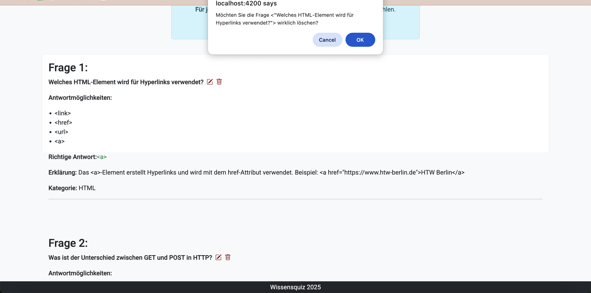

# WebTech Wissensquiz

## Beschreibung der Anwendung

Das **WebTech Wissensquiz** ist eine interaktive Webanwendung zur Überprüfung und Festigung des Wissens rund um die Themen der Lehrveranstaltung *Web-Technologien*. Nutzer:innen können Fragen beantworten und ihr Wissen zu verschiedenen Themenbereichen testen:

- **HTML** – Grundlagen des Webs
- **CSS** – Styles und Layouts
- **JavaScript** – Interaktive Funktionen und Logik
- **Angular** – Entwicklung moderner Single Page Applications
- **Backend** – Datenbanken, Serverlogik und APIs
- **Frontend & Backend** - Anbindung Frontend und Backend

Die Anwendung bietet sowohl eine Quiz-Ansicht als auch eine Verwaltungsoberfläche zum Erstellen, Bearbeiten und Löschen von Fragen.

## Screenshots

Im Folgenden findest du einige Screenshots, die die wichtigsten Funktionen und Ansichten der Anwendung zeigen.

---

### Startseite

Die Startseite gibt eine Einführung in das Projekt und motiviert zur Teilnahme am Quiz.


---

### Fragenübersicht und Menü

Hier sieht man alle gespeicherten Fragen. Es ist möglich, neue Fragen hinzuzufügen, bestehende zu bearbeiten oder zu löschen.
In der Menüanzeige sind die Quizzes hinterlegt.


---

### Frage erstellen und bearbeiten (Dialog)

In diesem Dialog können neue Fragen erstellt oder bestehende bearbeitet werden.


---

### Lösch-Dialog

Vor dem Löschen einer Frage erscheint ein Bestätigungsdialog, um unbeabsichtigtes Löschen zu verhindern.



---

### HTML-Quiz (Frageanzeige)

So sieht eine laufende Quizfrage im HTML-Bereich aus. Die Nutzer:innen haben 10 Sekunden Zeit zur Beantwortung.


---

### Quiz-Ergebnis

Am Ende wird eine Übersicht der richtigen Antworten und der benötigten Gesamtzeit angezeigt.


---

## Installationsanleitung

### Voraussetzungen
- Node.js (empfohlen: Version 18+)
- Angular CLI (`npm install -g @angular/cli`)
- MongoDB (lokal oder als Cloud-Service)

### Installation
1. Repository clonen:
   ```
   git clone https://github.com/ngnhinguyen/wissensquiz.git
   cd wissensquiz
   ```

2. Abhängigkeiten installieren:
   ```
   cd frontend
   npm install
   ng add @angular/material
   cd ../backend
   npm install
   ```

3. Optional MongoDB starten (falls lokal) und Umgebungsvariablen in `.env` anpassen:
   ```
   DB_CONNECTION=mongodb://localhost:27017/questions
   PORT=3002
   ```

4. Backend mit Quizfragen starten:
   ```
   cd backend
   node server.js
   ```

5. Frontend starten:
   ```
   cd frontend
   ng serve
   ```

6. Anwendung im Browser öffnen:
   ```
   http://localhost:4200
   ```

---

## Verwendete KI-Werkzeuge und deren Einsatz

- **ChatGPT (OpenAI)**
  - Unterstützung bei der Code-Generierung (Seed-Daten, Routing, MongoDB Queries)
  - Hilfe bei der Formulierung von Quizfragen
  - Überarbeitung von Texten und README
- **GitHub Copilot**
  - Code-Vervollständigungen im Angular-Frontend
---

## Weitere Features
- Personalisierte Quiz-Auswertung
- Punktesystem
